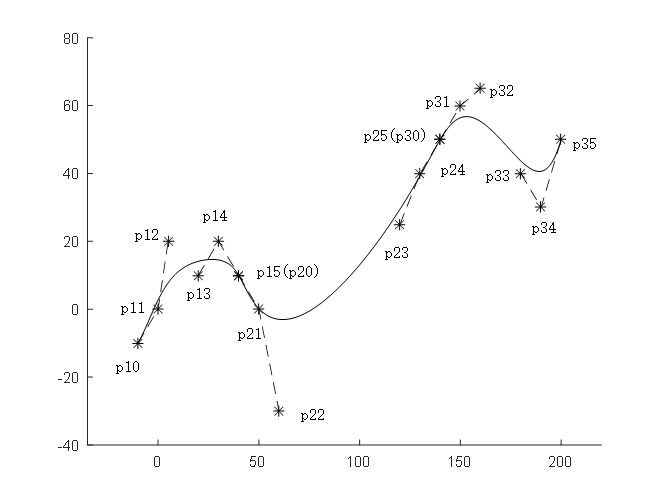

# 基于贝塞尔曲线的路径光滑拼接问题
使用贝塞尔曲线，通过合理选取控制点使轨迹在拼接点处轨迹连续、速度连续、曲率连续

## 1、3、5阶贝塞尔曲线的轨迹拼接

1.	考虑了前后两段轨迹均为直线时，使用5阶贝塞尔曲线进行连接。
2.	考虑了前后两段轨迹均为直线时，使用3阶贝塞尔曲线进行连接。
3.	考虑了前段轨迹为直线，后段轨迹为5阶贝塞尔曲线时，使用5阶贝塞尔曲线进行拼接。
4.	考虑了前段轨迹为直线，后段轨迹为5阶贝塞尔曲线时，使用3阶贝塞尔曲线进行拼接。
5.	考虑了前段轨迹为5阶贝塞尔曲线，后段轨迹也为5阶贝塞尔曲线时，使用5阶贝塞尔曲线进行拼接。
6.	考虑了前段轨迹为5阶贝塞尔曲线，后段轨迹为3阶贝塞尔曲线时，使用5阶贝塞尔曲线进行拼接。
7.	考虑了前段轨迹为3阶贝塞尔曲线，后段轨迹为5阶贝塞尔曲线时，使用5阶贝塞尔曲线进行拼接。
8.	考虑了前段轨迹为3阶贝塞尔曲线，后段轨迹也为3阶贝塞尔曲线时，使用5阶贝塞尔曲线进行拼接。

    示例：直线-5阶贝塞尔曲线-5阶贝塞尔曲线

## 圆弧与贝塞尔曲线的轨迹拼接

1.	考虑相邻轨迹之一为圆弧轨迹时，使用3阶贝塞尔曲线进行轨迹拼接。
2.	考虑相邻轨迹之一为圆弧轨迹时，使用5阶贝塞尔曲线进行轨迹拼接。
3.	考虑前后相邻两段路径均为圆弧轨迹时，使用5阶贝塞尔曲线进行轨迹拼接，

    示例：圆弧路径-5阶贝塞尔曲线-圆弧路径
    

## 简并5阶贝塞尔曲线
 1.  提供了一种基于直线和简并5阶贝塞尔曲线的移动机器人路径规划方法，该方法能够保证路径在接点处的切线连续与曲率连续。避免3阶贝塞尔曲线时曲线调整能力的缺失和5阶贝塞尔曲线时的复杂性过高导致用户体验感降低的问题。
示例：原曲线
    

简并贝塞尔曲线
    

## 鸣谢
- 此程序为在[仙工智能 SEER](https://github.com/seer-robotics/)实习期间完成(2021年暑假)，感谢[黄强盛老师](https://github.com/huangqiangsheng)在期间的指导。